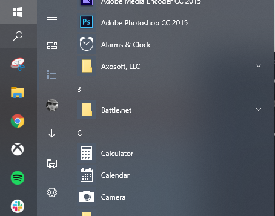

# Windows 10: Missing Search Icons

If you've arrived here, it means you've been plauged with the case of missing/corrupt icons for Windows Store applications, while using the search functionality in Windows 10.

I have identified a means to resolve the issue. It does not involve rebuilding the icon cache, re-associating your .ico file types, running a system file check, or any other one of the repeated options that never work. However, it does involve some manual effort, so I consider this a viable option only for those irritated enough to address it.

## Repository Contents

The `helpers` directory contains a Windows batch script that can be used to reset your icon cache. I've included this here for reference, though I do not expect it to be useful in remedying the issue.

The `corrupted` directory contains other corrupted Windows application files for your reference. If I find fixed icon replacements for those, I will move those references into the assets folder.

The `assets` directory contains applications icons found in the `WindowsApps` folder which can be used to manually fix the missing search icons using the method as described in the rest of this readme.

## Identifying the Issue

The reason rebuilding your icon cache never works, is because the standard icon cache databases everyone tells you to delete, are not related. Windows 10 stores icon caches in all sorts of places on your OS. The icons which you see when searching, come from _Cortana's icon cache_. To get there, open up Window's search and enter `%LocalAppData%\Packages`. This will take you to your `Packages` folder in your local `AppData` (C:\Users\{USER}\AppData\Local\Packages). From here, look for the `Cortana` app. In my case, which will likely be the same for most Windows 10 users, it was called `Microsoft.Windows.Cortana_cw5n1h2txyewy`.

Within this Cortana application folder, under `LocalState`, you'll find an `AppIconCache` folder (C:\Users\{USER}\AppData\Local\Packages\Microsoft.Windows.Cortana_cw5n1h2txyewy\LocalState\AppIconCache\100).

If you look in this folder, you will see a lot of files -- these are just image files which Microsoft has not given an extenion. If you append ".jpg" to the end, you'll see the icons.

I would recommend you copy the entire folder to your desktop, open a command prompt, navigate to that folder `cd C:\Users\{USER}\Desktop\AppIconCache\100` then execute `ren * *.jpg` to batch rename all of these files. You'll quickly recognize many of the applications you have installed on your computer.

If you continue to analyze this folder content, you'll also find numerous icons that appear corrupt -- and sure enough, they all seem to be related to the Microsoft Store.

## How To Manually Repair the Icons

All Windows Store applications are installed to the `WindowsApps` folder on your C drive (C:\Program Files\WindowsApps). By default, this is a protected folder and in order to gain access, you will need to first take ownership of it.

To do that, right click the `WindowsApps` folder, click `Properties`, then choose the `Security` tab and hit the `Advanced` button near the bottom. You'll see that the current Owner is `TrustedInstaller`. Click the `Change` link to the right of that and enter your Windows profile name in the input box to make yourself the owner. Ensure that you choose to _Replace owner on all subcontainers and objects_. Once you've taken ownership, be sure to grant yourself `Full Control` by using the `Add` button, selecting your Widows profile from the `Select a principal` link.

Now that you have access to this folder, you can being the process of replacing your icons. I would recommend you choose your most frequently accessed applications, the ones that bother you the most, and work on replacing those.

I found that most applications should have an image asset that contains the name `StoreLogo` in some form. Searching within the `WindowsApps` folder for this _StoreLogo_ term, will yeild many icons to get the ball rolling.

All you need to do, is find the application icon you are trying to fix, which should be a .png image, and rename it to match the filename you found in the Cortana `AppIconCache` folder.

## Example

To fix the Xbox application, navigate to the `WindowsApps` folder and look for the application folder named `Microsoft_GamingApp_8wekyb3d8bbwe!Microsoft_Xbox_App`. Within that, search around for the image asset named `Xbox_StoreLogo.scale-100.png` and copy that to your desktop.

Then, navigate to Cortana's `AppIconCache` folder and find the file named `Microsoft_GamingApp_8wekyb3d8bbwe!Microsoft_Xbox_App`.

Now, rename `Xbox_StoreLogo.scale-100.png` (that you copied to your desktop), to `Microsoft_GamingApp_8wekyb3d8bbwe!Microsoft_Xbox_App` and then move (and replace) it with the corrupted version in the Cortana `AppIconCache` folder.

If you now search Xbox in Windows, you'll find that your icon is fixed.

## Head Start

In order to save yourself some time, check out the `apps` folder in this repository. I've included some application icons. In each application folder, you'll find the `logo.png` icon, and a reference to the name of the Cortana icon file. Note that this is the _corrupted_ version -- I've only included it only as a filename reference. I can't confirm if the filename will be the same for other uses.

## Important

When you are done or otherwise tired of fixing icons, make sure you return the `WindowsApps` folder back to its rightful owner.

To do that, right click the `WindowsApps` folder, click `Properties`, then choose the `Security` tab and hit the `Advanced` button near the bottom. Click the `Change` link next to the current owner (which should be yourself), and enter `NT Service\TrustedInstaller` in the input box to make TrustedInstaller the owner again.

# Noteworthy

Bearing in mind, this is only a stop-gap solution and ideally, finding the root cause would be the ultimate end goal. However, I believe that rests squarely on Microsoft's shoulders.

I considered writing a program that would automatically find and replace some of the most common Windows icons, (ie: Calculator, Settings, etc), but I'm not not sure I really want to invest the time. If anyone else would like to explore that idea, I think it would be great.

I'll further add that in my efforts to narrow down the real cause, I found some instances where the `AppManifest.xml` files for applications referenced non-existant icon image assets. There were also some instances where the AppManifest correctly referenced the image asset, yet was still missing while using Windows Search.

My personal feeling is that whatever is happening under the hood, is related to Cortana, and that whatever process builds the Cortana icon cache, is either unable to find the application manifest files, or is otherwise consuming them incorrectly, and thus it does not build the icon cache with the appropriate application icons.
