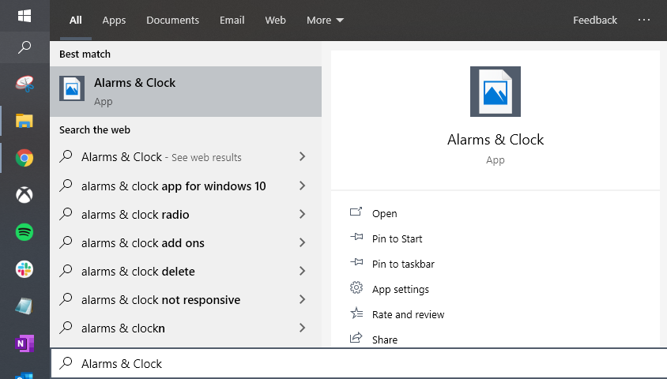

# Windows 10: Missing Search Icons

If you've arrived here, it means you've been plauged with the case of missing/corrupt icons for Windows applications, while using the search functionality in Windows 10.

## Update 2: Google Drive File Stream

I was able to resolve my issue after having determined this is related to **Google Drive File Stream**. I believe the root issue stems from a [limitation with shell overlay icons](https://devblogs.microsoft.com/oldnewthing/20190313-00/?p=101094) in Windows. I further believe that the direct issue, is in how Google is choosing to dynamically create these icon overlays, possibly in an effort to circumvent this shell icon limit in Windows. Regardless, I have had consistent success by executing the following steps:

1. Uninstall Google Drive File Stream
2. Download a fresh copy of `googledrivefilestream.exe` from [Google answer #7329379](https://support.google.com/drive/answer/7329379). Note the name of the installer. **DO NOT** download the installer named `GoogleDriveFSSetup.exe` which you would find from [Google answer #7491144](https://support.google.com/a/answer/7491144).
3. Through Windows **Display Settings**, change your scale setting from *100% > 150% > 175% > 100%*.
4. Restart your computer. Your icons should be restored.
5. Reinstall Google Drive File Stream.

I will note that this does not permanently resolve the issue. Your mileage will vary with regards to how long your icons will remain restored. Alternatively, you may still continue to utilize the [repair.py](https://github.com/phuze/windows-10-missing-search-icons/blob/master/repair/repair.py) tool. All of the details and instructions you need to expand on the repair toolkit ([repairs.json](https://github.com/phuze/windows-10-missing-search-icons/blob/master/repair/toolkit/repairs.json)) can be found within the remainder of this readme.

_Important:_ Thanks to the user [@claell](https://github.com/phuze/windows-10-missing-search-icons/issues/4#issuecomment-732159630), a ticket was raised via [Google's issue tracker](https://issuetracker.google.com/issues/173912342) and has been file internally for the Google development team.

***

## Update 1: Python Repair Tool

I have built a Python tool to help automate the process. To use it, open an elevated command prompt, navigate to the directory with `repair.py` and run the Python script. You will need to have [Python 3.x](https://www.python.org/downloads/) installed on your machine.

`python repair.py`

***

## Repository Contents

The `helpers` directory contains a Windows batch script that can be used to reset your icon cache. I've included this here for reference, though I do not expect it to be useful in remedying the issue.

The `repair` directory contains the repair tool `repair.py`, in addition to an `icons` folder which contains icon fixes, as well as a `toolkit` folder which contains both the repair list `repairs.json` as well as a few files used in the repair process.

## Identifying the Issue

The reason rebuilding your icon cache never works, is because the standard icon cache databases everyone tells you to delete, are not related. Windows 10 stores icon caches in all sorts of places on your OS. The icons which you see when searching, come from _Search's icon cache_ (previously _Cortana's icon cache_). To get there, open up Window's search and enter `%LocalAppData%\Packages`. This will take you to your `Packages` folder in your local `AppData`.

`C:\Users\{USER}\AppData\Local\Packages`

From here, look for the `Search` app. In my case, which will likely be the same for most Windows 10 users, it was called `Microsoft.Windows.Search_cw5n1h2txyewy` (previously named `Microsoft.Windows.Cortana_cw5n1h2txyewy`). Within this Search application folder, under `LocalState`, you'll find an `AppIconCache` folder.

`C:\Users\{USER}\AppData\Local\Packages\Microsoft.Windows.Search_cw5n1h2txyewy\LocalState\AppIconCache\100`

If you look in this folder, you will see a lot of files -- these are just image files which Microsoft has not given an extenion. If you append ".jpg" to the end, you'll see the icons.

I would recommend you copy the entire folder to your desktop, open a command prompt, navigate to that folder `cd C:\Users\{USER}\Desktop\AppIconCache\100` then execute `ren * *.jpg` to batch rename all of these files. You'll quickly recognize many of the applications you have installed on your computer.

If you continue to analyze this folder content, you'll also find numerous icons that appear corrupt.

## How To Manually Repair the Icons

All Windows Store applications are installed to the `WindowsApps` folder on your C drive (C:\Program Files\WindowsApps). By default, this is a protected folder and in order to gain access, you will need to first take ownership of it.

To do that, right click the `WindowsApps` folder, click `Properties`, then choose the `Security` tab and hit the `Advanced` button near the bottom. You'll see that the current Owner is `TrustedInstaller`. Click the `Change` link to the right of that and enter your Windows profile name in the input box to make yourself the owner. Ensure that you choose to _Replace owner on all subcontainers and objects_. Once you've taken ownership, be sure to grant yourself `Full Control` by using the `Add` button, selecting your Widows profile from the `Select a principal` link.

Now that you have access to this folder, you can begin the process of replacing your icons. I would recommend you choose your most frequently accessed applications, the ones that bother you the most, and work on replacing those.

I found that most applications should have an image asset that contains the name `StoreLogo` in some form. Searching within the `WindowsApps` folder for this _StoreLogo_ term, will yeild many icons to get the ball rolling.

All you need to do, is find the application icon you are trying to fix, which should be a .png image, and rename it to match the filename you found in the Search `AppIconCache` folder.

## Example

To fix the Xbox application, navigate to the `WindowsApps` folder and look for the application folder named `Microsoft_GamingApp_8wekyb3d8bbwe!Microsoft_Xbox_App`. Within that, search around for the image asset named `Xbox_StoreLogo.scale-100.png` and copy that to your desktop.

Then, navigate to Search's `AppIconCache` folder and find the file named `Microsoft_GamingApp_8wekyb3d8bbwe!Microsoft_Xbox_App`.

Now, rename `Xbox_StoreLogo.scale-100.png` (that you copied to your desktop), to `Microsoft_GamingApp_8wekyb3d8bbwe!Microsoft_Xbox_App` and then move (and replace) it with the corrupted version in the Search `AppIconCache` folder.

If you now search Xbox in Windows, you'll find that your icon is fixed.

## Head Start

In order to save yourself some time, check out the [icons](https://github.com/phuze/windows-10-missing-search-icons/tree/master/repair/icons) folder in this repository. I've included some application icons. In each application folder, you'll find the `logo.png` icon, and a reference to the name of the Search icon file. Note that this is the _corrupted_ version -- I've only included it only as a filename reference. I can't confirm if the filename will be the same for other uses.

## Important

When you are done or otherwise tired of fixing icons, make sure you return the `WindowsApps` folder back to its rightful owner.

To do that, right click the `WindowsApps` folder, click `Properties`, then choose the `Security` tab and hit the `Advanced` button near the bottom. Click the `Change` link next to the current owner (which should be yourself), and enter `NT Service\TrustedInstaller` in the input box to make TrustedInstaller the owner again.

## Noteworthy

In my efforts to narrow down the root cause, I found some instances where the `AppManifest.xml` files for applications referenced non-existant icon image assets. There were also some instances where the AppManifest correctly referenced the image asset, yet was still missing while using Windows Search.
